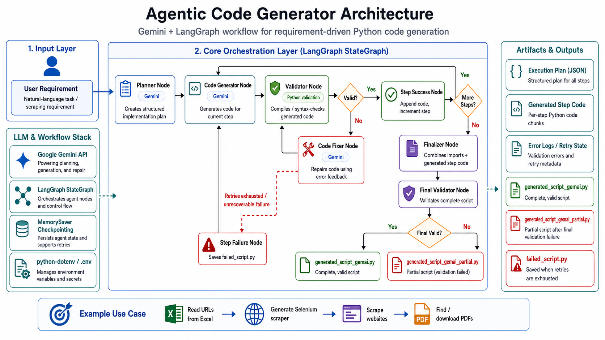

# Agentic Code Generator with Gemini and LangGraph

An agentic Python code-generation framework that uses **Google Gemini** and **LangGraph** to generate Python automation scripts from natural-language requirements.

This project is designed around a practical scraping workflow: it can generate code that reads website URLs from an Excel file, visits those websites, scrapes attachment/document sections, identifies PDF files, and produces or downloads PDF-related outputs based on the user requirement.

## Architecture



The agent follows a **plan → generate → validate → fix** workflow:

- Creates a structured implementation plan from a user requirement
- Generates Python code step by step
- Validates generated code using Python compilation checks
- Retries and repairs failed code using error feedback
- Saves the final generated script, partial output, or failed script for debugging

## Features

- Gemini-powered planning, code generation, and repair
- LangGraph workflow orchestration using agent nodes
- Step-by-step Python code generation
- Syntax validation using Python compilation
- Retry and repair loop for failed code
- Partial output saving for debugging
- Environment-based API key configuration
- Supports scraper-generation workflows using Excel-based URL input

## Example Use Case

The current example focuses on generating a Selenium-based website scraper/downloader workflow.

The generated script can be customized to:

- Read URLs from an Excel file such as `urls.xlsx`
- Open each website URL in a browser automation session
- Navigate to attachment or document sections
- Search for PDF files on the page or inside iframes
- Extract PDF filenames or PDF links
- Download PDFs when the requirement asks for downloading
- Print a clear summary of processed URLs and discovered PDF files

## Project Structure

```text
.
├── agentic_code_generator.py
├── requirements.txt
├── .env.example
├── .gitignore
├── docs/
│   └── architecture.png
└── README.md
```

## Requirements

- Python 3.10+
- Google Gemini API key

## Installation

Clone the repository:

```bash
git clone https://github.com/raghava430/generate_code.git
cd generate_code
```

Create and activate a virtual environment:

```bash
python -m venv venv
venv\Scripts\activate
```

Install dependencies:

```bash
pip install -r requirements.txt
```

## Environment Setup

Create a `.env` file in the project root:

```env
GOOGLE_API_KEY=your_google_api_key_here
```

Do not commit `.env` to GitHub.

## Usage

Run the agent:

```bash
python agentic_code_generator.py
```

The script reads the `user_requirement` defined inside the `main()` function, creates a step-by-step plan, generates Python code through the LangGraph workflow, validates each step, and saves the generated output.

To customize the generated scraper/downloader, update the `user_requirement` variable with details such as:

```text
Build a Selenium scraper that reads URLs from urls.xlsx, opens each URL, finds PDF attachments, downloads the PDF files, and prints a summary for each website.
```

## Generated Outputs

Depending on validation results, the workflow may create files such as:

```text
generated_script_gemai.py
generated_script_gemai_partial.py
failed_script.py
```

These files are generated artifacts and should not be committed unless intentionally needed for documentation or examples.

## Tech Stack

- Python
- Google Gemini
- LangGraph
- python-dotenv
- Selenium-oriented generated workflows
- Excel-based input workflows

## Notes

Generated scripts, failed scripts, local Excel files, downloaded PDFs, virtual environments, cache files, and environment variables should not be committed to GitHub.

Sensitive values such as API keys must stay in `.env`, which is ignored by Git.

## License

This project is for portfolio and learning purposes.
